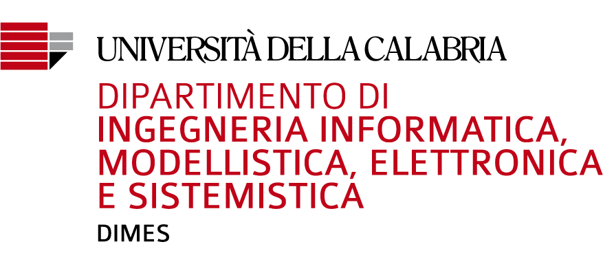

<div id="top"></div>
<!--
*** Thanks for checking out the Best-README-Template. If you have a suggestion
*** that would make this better, please fork the repo and create a pull request
*** or simply open an issue with the tag "enhancement".
*** Don't forget to give the project a star!
*** Thanks again! Now go create something AMAZING! :D
-->


<!-- PROJECT SHIELDS -->
<!--
*** I'm using markdown "reference style" links for readability.
*** Reference links are enclosed in brackets [ ] instead of parentheses ( ).
*** See the bottom of this document for the declaration of the reference variables
*** for contributors-url, forks-url, etc. This is an optional, concise syntax you may use.
*** https://www.markdownguide.org/basic-syntax/#reference-style-links
-->
[![Contributors][contributors-shield]][contributors-url]
[![Forks][forks-shield]][forks-url]
[![Stargazers][stars-shield]][stars-url]
[![Issues][issues-shield]][issues-url]
[![MIT License][license-shield]][license-url]
[![LinkedIn][linkedin-shield]][linkedin-url]


<!-- PROJECT LOGO -->
<br />
<div align="center">
  <a href="https://github.com/DeanSupertramp/pyTiePie">
    
  </a>

<h3 align="center">pyTiePie</h3>

  <p align="center">
Simulation, design and implementation of a non-destructive diagnostic system based on capacitive sensors.
    <br />
    <a href="https://github.com/DeanSupertramp/pyTiePie"><strong>Explore the docs »</strong></a>
    <br />
    <br />
    <a href="https://github.com/DeanSupertramp/pyTiePie">View Demo</a>
    ·
    <a href="https://github.com/DeanSupertramp/pyTiePie/issues">Report Bug</a>
    ·
    <a href="https://github.com/DeanSupertramp/pyTiePie/issues">Request Feature</a>
  </p>
</div>


<!-- TABLE OF CONTENTS -->
<details>
  <summary>Table of Contents</summary>
  <ol>
    <li>
      <a href="#about-the-project">About The Project</a>
      <ul>
        <li><a href="#built-with">Built With</a></li>
      </ul>
    </li>
    <li>
      <a href="#getting-started">Getting Started</a>
      <ul>
        <li><a href="#prerequisites">Prerequisites</a></li>
        <li><a href="#installation">Installation</a></li>
      </ul>
    </li>
    <li><a href="#roadmap">Roadmap</a></li>
    <li><a href="#license">License</a></li>
    <li><a href="#contact">Contact</a></li>
    <li><a href="#acknowledgments">Acknowledgments</a></li>
  </ol>
</details>


<!-- ABOUT THE PROJECT -->
## About The Project

<!-- 
[![Product Name Screen Shot][product-screenshot]](https://example.com) -->

<!-- Here's a blank template to get started: To avoid retyping too much info. Do a search and replace with your text editor for the following: `DeanSupertramp`, `pyTiePie`, `DeanSupertramp`, `andrea-alecce`, `gmail`, `andrealecce3`, `project_title`, `project_description` -->

**Simulation, design and implementation of a non-destructive diagnostic system based on capacitive sensors.**

My master's thesis revolves around non-destructive technologies for diagnostics, using capacitive sensors. The simulations, signal acquisitions, data processing were done using Python and Matlab scripts and using a TiePie HS5, an all-in-one Arbitrary Waveform Generator and Acquisition system. The thesis foresees the realization of a portable system to carry out these tests
<p align="right">(<a href="#top">back to top</a>)</p>

### Built With
* [Python3](https://www.python.org/)
* [TiePie](https://www.tiepie.com/en)
* [LTSpice](https://www.analog.com/en/design-center/design-tools-and-calculators/ltspice-simulator.html)
* [MATLAB](https://mathworks.com/products/matlab.html)
* Developed in [Spyder](https://www.spyder-ide.org/) and [VSCode](https://code.visualstudio.com/)
* and other future tools...
<p align="right">(<a href="#top">back to top</a>)</p>

<!-- GETTING STARTED -->
## Getting Started
To get a local copy up and running follow these simple example steps.

### Prerequisites
This is a list of things you need for use the software and how to install them.
1. Python3
2. Driver and software of TiePie (mod. HS5) at: [https://www.tiepie.com/en/usb-oscilloscope/handyscope-hs5#downloads](https://www.tiepie.com/en/usb-oscilloscope/handyscope-hs5#downloads)
3. Install the Python bindings by executing: 
    ```sh
    pip install python-libtiepie
    ```
    more information [here](https://www.tiepie.com/en/libtiepie-sdk/python).

4. Install packages manually:
    * Pandas
      ```sh
      pip install pandas
      ```
      or
      ```sh
      conda install pandas
      ```
    * Numpy [reference here](https://numpy.org/install/)
      ```sh
      pip install numpy
      ```
      or
      ```sh
      conda install numpy
      ```
    * Scipy [reference here](https://scipy.org/install/)
      ```sh
      pip install scipy
      ```
    * Matplotlib [reference here](https://matplotlib.org/stable/users/installing/index.html)
      ```sh
      pip install matplotlib
      ```
    * GitPython [reference here](https://gitpython.readthedocs.io/en/stable/)
      ```sh
      pip install gitpython
      ```
    * PyUsb [reference here](https://pypi.org/project/pyusb/)
      ```sh
      pip install pyusb
      ```
5. ...or you can use the requirements file:
    ```sh
    pip3 install -r requirements.txt
    ```

### Installation
1. Clone the repo
   ```sh
   git clone https://github.com/DeanSupertramp/pyTiePie.git
   ```
<p align="right">(<a href="#top">back to top</a>)</p>

### Map of the repository
* [project](https://github.com/DeanSupertramp/pyTiePie/tree/main/project): contains scripts written to work with TiePie.
* [libtiepie](https://github.com/DeanSupertramp/pyTiePie/tree/main/libtiepie): TiePie's Python module.
* [example](https://github.com/DeanSupertramp/pyTiePie/tree/main/examples): contains example for TiePie written in Python.
* [images](https://github.com/DeanSupertramp/pyTiePie/tree/main/images): contains images useful for the repository or output graphs of Python's script.
* [utils](https://github.com/DeanSupertramp/pyTiePie/tree/main/utils): contains scripts, Python's module, tools and simulations:
  * [Excel](https://github.com/DeanSupertramp/pyTiePie/tree/main/utils/Excell) files
  * [Spice](https://github.com/DeanSupertramp/pyTiePie/tree/main/utils/Spice_Circuit): LTSpice simulation files
  * [script](https://github.com/DeanSupertramp/pyTiePie/tree/main/utils/script): Python script for simulation and analysis.  

<!-- USAGE EXAMPLES -->
<!-- ## Usage

Use this space to show useful examples of how a project can be used. Additional screenshots, code examples and demos work well in this space. You may also link to more resources.

_For more examples, please refer to the [Documentation](https://example.com)_

<p align="right">(<a href="#top">back to top</a>)</p>
 -->


<!-- ROADMAP -->
## Roadmap
- [x] Circuit sensitivity analysis respect to a capacity variation, simulating the use of an ADC for acquisition
  - [x] Impedance measurement with R series
  - [x] Calculate the voltage difference measured for a given variation in capacitance
  - [x] Simulate the quantization of the ADC
  - [x] Apply lock-in
  - [x] Derive the phasors at the various frequencies and therefore dC at the various frequencies by comparing the estimated dC with the theoretical simulated one
- [ ] Impedance measurement with Wheatstone bridge
  - [ ] Simulate both the reference capacitor on a healthy point and in the air
  - [ ] Repeat the analysis for the estimate of dC
- [x] Data elaboration and manipulation 
  - [x] Signal filtering (Butterworth)
  - [x] Lock-in
  - [x] Model fitting
  - [x] Extrapolation of the capacity value
  - [x] Plotting
- [ ] Methods of data acquisition
  - [ ] Live
  - [x] Offline (from data pre-saved)
- [x] Generation of a map of capacity value from a generic UUT (Unit Under Test)
- [x] CLI implementation
  - [x] Parsing input
  - [x] TiePie basic control (using libtiepie module and variables)
- [ ] Implement data processing and capacity analysis in the cli


See the [open issues](https://github.com/DeanSupertramp/pyTiePie/issues) for a full list of proposed features (and known issues).

<p align="right">(<a href="#top">back to top</a>)</p>


<!-- CONTRIBUTING -->
<!-- ## Contributing

Contributions are what make the open source community such an amazing place to learn, inspire, and create. Any contributions you make are **greatly appreciated**.

If you have a suggestion that would make this better, please fork the repo and create a pull request. You can also simply open an issue with the tag "enhancement".
Don't forget to give the project a star! Thanks again!

1. Fork the Project
2. Create your Feature Branch (`git checkout -b feature/AmazingFeature`)
3. Commit your Changes (`git commit -m 'Add some AmazingFeature'`)
4. Push to the Branch (`git push origin feature/AmazingFeature`)
5. Open a Pull Request

<p align="right">(<a href="#top">back to top</a>)</p>
 -->


<!-- LICENSE -->
## License

Distributed under the MIT License. See `LICENSE.txt` for more information.

<p align="right">(<a href="#top">back to top</a>)</p>


<!-- CONTACT -->
## Contact

Andrea Alecce - [@DeanSupertramp](https://twitter.com/DeanSupertramp) - andrealecce3@gmail.com

Project Link: [https://github.com/DeanSupertramp/pyTiePie](https://github.com/DeanSupertramp/pyTiePie)

<p align="right">(<a href="#top">back to top</a>)</p>


<!-- ACKNOWLEDGMENTS -->
## Acknowledgments

* [Prof. Marco Ricci]()
* []()
* []()

<p align="right">(<a href="#top">back to top</a>)</p>


<!-- MARKDOWN LINKS & IMAGES -->
<!-- https://www.markdownguide.org/basic-syntax/#reference-style-links -->
[contributors-shield]: https://img.shields.io/github/contributors/DeanSupertramp/pyTiePie.svg?style=for-the-badge
[contributors-url]: https://github.com/DeanSupertramp/pyTiePie/graphs/contributors
[forks-shield]: https://img.shields.io/github/forks/DeanSupertramp/pyTiePie.svg?style=for-the-badge
[forks-url]: https://github.com/DeanSupertramp/pyTiePie/network/members
[stars-shield]: https://img.shields.io/github/stars/DeanSupertramp/pyTiePie.svg?style=for-the-badge
[stars-url]: https://github.com/DeanSupertramp/pyTiePie/stargazers
[issues-shield]: https://img.shields.io/github/issues/DeanSupertramp/pyTiePie.svg?style=for-the-badge
[issues-url]: https://github.com/DeanSupertramp/pyTiePie/issues
[license-shield]: https://img.shields.io/github/license/DeanSupertramp/pyTiePie.svg?style=for-the-badge
[license-url]: https://github.com/DeanSupertramp/pyTiePie/blob/master/LICENSE.txt
[linkedin-shield]: https://img.shields.io/badge/-LinkedIn-black.svg?style=for-the-badge&logo=linkedin&colorB=555
[linkedin-url]: https://linkedin.com/in/andrea-alecce
[product-screenshot]: images/screenshot.png
